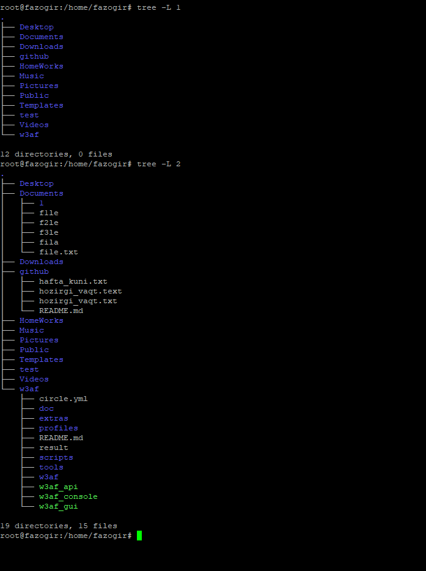

## 2_linux_file_system ##
## Commands to create and use files ##
## 1.2 Learn these commands  ##
## cd - Changes to another directory ##
## - cd - Changes to another directory
## - pwd - Prints the name of the current (or present) working directory
## - mkdir - Creates a directory
## - chmod - Changes the permission on a file or directory
## - ls - Lists the contents of a directory
## - touch - create file ##

 

## 1.3 Practice this and take screenshot
The following steps lead you through the process of creating directories within your home directory and moving among your directories, with a mention of setting appropriate file permissions:
1. Go to your home directory. To do this, simply type cd in a shell and press Enter.(For other ways of referring to your home directory, see the sidebar “Identifying Directories.”)
2. To make sure that you’re in your home directory, type pwd. When I do this, I get the following response (yours will reflect your home directory):
$ pwd
/home/mustofa
3. Create a new directory called test in your home directory, as follows:
$ mkdir test
4. Check the permissions of the directory:
##
- Explain like this: This listing shows that test is a directory (d). The d is followed by the permissions (rwxr-xr-x), The rest of the information indicates the owner (mustofa), the group (mustofa), and the date that the files in the directory were most recently modified (May 26 at 18:48 ).

## Using metacharaters and Operators ##

## 1.4 Explore about metacharacters for matching filenames:
## * - matches any number of characters.
## ? - matches any one character.
## [...] - matches any one of the characters between the brackets, which can include a hyphen-separated range of letters or numbers.

## Using file-redirection metacharacters ##

## 1.5 Research types of file-direction characters
## < - directs the contents of a file to the command. In most cases, this is the default action expected by the command and the use of the character is optional; using less bigfile is the same as less < bigfile.
## > - directs the standard output of a command to a file. If the file exists, the content of that file is overwritten.
## 2> - directs standard error (error messages) to the file.
## &> - directs both standard output and standard error to the file.
## >> -  directs the output of a command to a file, adding the output to the end of the existing file.

## Understanding File Permissions and Ownership
## 1.6 Learn deeply file types
## For a regular file, a dash appears in front of the nine-bit permissions indicator. Instead of a dash, you might see a d (for a directory), l (for a symbolic link), b (for a block device), c (for a character device), s (for a socket), or p (for a named pipe).

## Homework ##
## 1. Install tree package
## a. learn about tree
## b. use it and take screenshots

# 2. Create a directory in your home directory called projects. In the projects directory, create nine empty files that are named house1, house2, house3, and so on up to house9. Assuming that there are lots of other files in that directory, come up with a single argument to ls that would list just those nine files.

[!task10](./img/h2.PNG)

# 3.Make the $HOME/projects/houses/doors/ directory path. Create the following empty files within this directory path (try using absolute and relative paths from your home directory):
## $HOME/projects/houses/bungalow.txt
## $HOME/projects/houses/doors/bifold.txt
## $HOME/projects/outdoors/vegetation/landscape.txt
